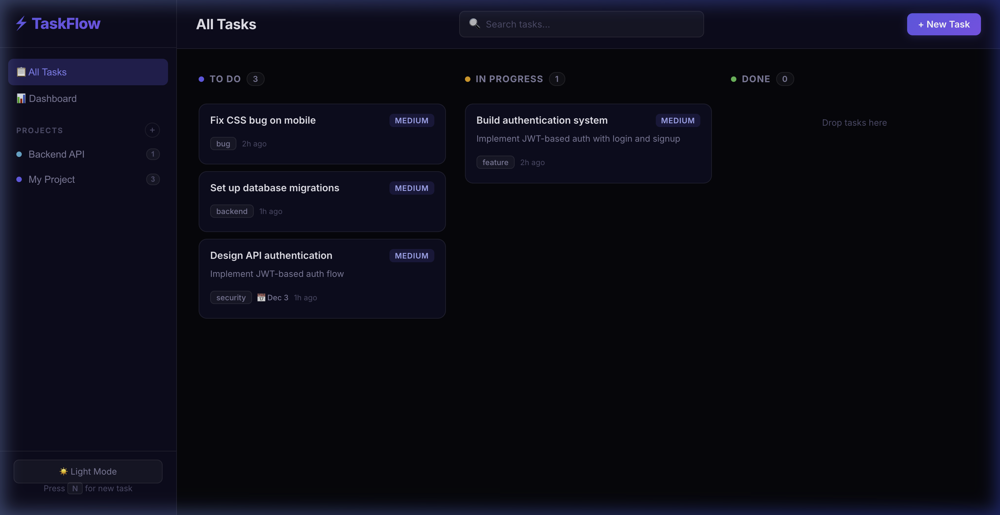

# ⚡ TaskFlow — Full-Stack Kanban Task Tracker

A production-grade, enterprise-ready Kanban task management application built with **React 18**, **Express**, and **SQLite**. Featuring a dark-mode glassmorphism UI, drag-and-drop board, real-time statistics dashboard, and comprehensive security hardening.

   



## ✨ Features

### Core
- **Kanban Board** — Drag-and-drop tasks between To Do, In Progress, and Done columns
- **Full CRUD** — Create, edit, and delete tasks with title, description, priority, and labels
- **Due Dates** — Date picker with smart display (Today, Tomorrow, Xd left) and overdue highlighting
- **Multi-Project Support** — Create and switch between projects with color-coded sidebar
- **Statistics Dashboard** — Completion rates, priority distribution charts, recent activity
- **Dark/Light Theme** — Toggle with persistent localStorage preference
- **Search** — Debounced full-text search across all tasks
- **Keyboard Shortcuts** — Press `N` for new task, `Escape` to close modals

### Production Quality
- **🔒 Security** — Helmet.js headers, rate limiting, XSS sanitization, CORS config
- **♿ Accessibility** — ARIA roles, focus traps, skip-to-content, screen reader support
- **⚡ Performance** — Gzip compression, search debouncing, WAL-mode SQLite
- **🛡️ Error Handling** — React Error Boundary, global Express error handler, toast notifications
- **📱 Responsive** — Works on desktop, tablet, and mobile

## 🛠️ Tech Stack

| Layer | Technology |
|---|---|
| Frontend | React 18, Vite 5 |
| Styling | Vanilla CSS (dark/light mode, glassmorphism) |
| Backend | Node.js, Express 4 |
| Database | SQLite via better-sqlite3 (WAL mode) |
| Security | Helmet, express-rate-limit, compression |
| Testing | Vitest, React Testing Library |
| CI/CD | GitHub Actions (Node 18 + 20 matrix) |
| Font | Inter (Google Fonts) |

## 🚀 Quick Start

```bash
# Install dependencies
npm install

# Start development server (frontend + backend)
npm run dev
```

Open [http://localhost:5173](http://localhost:5173) in your browser.

## 📁 Project Structure

```
taskflow/
├── index.html                  # Entry HTML with SEO meta + skip-to-content
├── package.json                # Dependencies & scripts
├── vite.config.js              # Vite config with API proxy
├── .editorconfig               # Consistent coding styles
├── .env.example                # Environment variable documentation
├── .gitignore                  # Git ignore rules
├── LICENSE                     # MIT License
├── src/
│   ├── main.jsx                # React entry (wrapped in ErrorBoundary)
│   ├── App.jsx                 # Main app shell + state management
│   ├── index.css               # Design system (900+ lines)
│   └── components/
│       ├── Board.jsx           # Kanban board (ARIA regions, drag-and-drop)
│       ├── TaskCard.jsx        # Task card (ARIA labels, timeAgo)
│       ├── TaskModal.jsx       # Create/edit modal (focus trap, ARIA dialog)
│       ├── ConfirmDialog.jsx   # Confirmation dialog (role=alertdialog)
│       ├── Toast.jsx           # Toast notifications (auto-dismiss)
│       ├── Sidebar.jsx         # Navigation + project creation
│       ├── Dashboard.jsx       # Statistics + recent activity
│       └── ErrorBoundary.jsx   # React error catcher with retry
└── server/
    ├── index.js                # Express entry (Helmet, rate limit, compression)
    ├── db.js                   # SQLite setup + schema
    ├── middleware/
    │   └── sanitize.js         # XSS sanitization middleware
    └── routes/
        ├── tasks.js            # Task CRUD API (validated + paginated)
        └── projects.js         # Project CRUD API (validated)
```

## 🔒 Security Features

| Feature | Implementation |
|---|---|
| HTTP Headers | `helmet()` — CSP, HSTS, X-Frame-Options, X-Content-Type-Options |
| Rate Limiting | 100 requests per 15 minutes per IP (configurable) |
| XSS Prevention | HTML tag stripping on all request body fields |
| Input Validation | Length limits, enum checks, required fields |
| CORS | Configurable allowed origins via `ALLOWED_ORIGIN` env var |
| SQL Injection | Parameterized queries throughout |
| Request Tracing | `X-Request-Id` header on every response |
| Error Masking | Stack traces hidden in production |

## 🔌 API Endpoints

| Method | Endpoint | Description |
|---|---|---|
| `GET` | `/api/tasks` | List tasks (`?search=`, `?status=`, `?project_id=`) |
| `POST` | `/api/tasks` | Create task |
| `PUT` | `/api/tasks/:id` | Update task |
| `PATCH` | `/api/tasks/:id/move` | Move task to different column |
| `DELETE` | `/api/tasks/:id` | Delete task |
| `GET` | `/api/tasks/stats/summary` | Task statistics |
| `GET` | `/api/tasks/recent/completed` | Recently completed tasks |
| `GET` | `/api/projects` | List projects (with task counts) |
| `POST` | `/api/projects` | Create project |
| `PUT` | `/api/projects/:id` | Update project |
| `DELETE` | `/api/projects/:id` | Delete project |
| `GET` | `/api/health` | Health check |

## ♿ Accessibility

- Skip-to-content link for keyboard users
- `role="dialog"` / `role="alertdialog"` on modals
- Focus trap inside modals (Tab cycles within)
- Focus restored to trigger element on modal close
- `aria-label` on all interactive elements
- `aria-live` region for toast notifications
- `aria-hidden` on decorative elements
- Semantic `<main>`, `<nav>` elements
- `htmlFor` / `id` pairs on all form inputs
- `<noscript>` fallback

## 📜 Scripts

| Command | Description |
|---|---|
| `npm run dev` | Start frontend + backend concurrently |
| `npm run dev:client` | Start Vite dev server only |
| `npm run dev:server` | Start Express API only |
| `npm run build` | Build frontend for production |
| `npm test` | Run unit tests |
| `npm run test:watch` | Run tests in watch mode |

## ⚙️ Environment Variables

See [`.env.example`](.env.example) for all available variables.

| Variable | Default | Description |
|---|---|---|
| `PORT` | `3001` | API server port |
| `NODE_ENV` | `development` | Environment (`production` enables strict security) |
| `ALLOWED_ORIGIN` | `*` | CORS allowed origin in production |

## 📝 License

[MIT](LICENSE)
