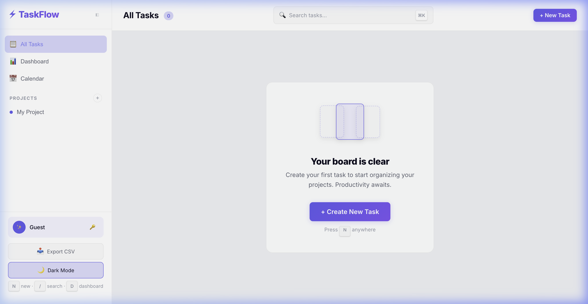
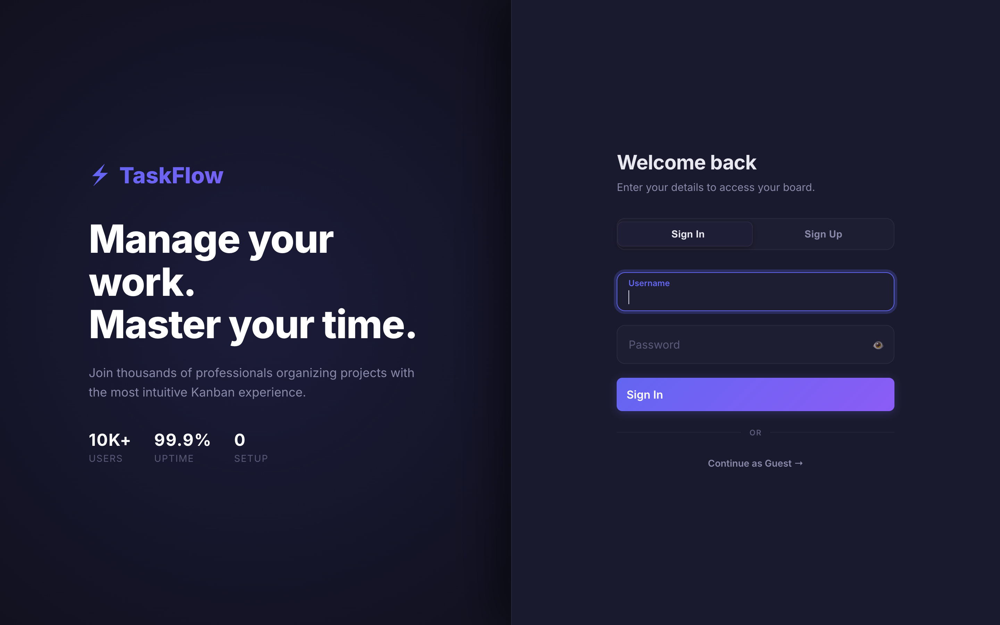

# ⚡ TaskFlow — Full-Stack Kanban Task Tracker

A production-grade, enterprise-ready Kanban task management application built with **React 18**, **Express**, and **SQLite**. Featuring a dark-mode glassmorphism UI, drag-and-drop board, real-time statistics dashboard, subtask checklists, and comprehensive security hardening.

🔗 **[Live Demo → bossiq-taskflow.vercel.app](https://bossiq-taskflow.vercel.app)**

     

<p align="center">
  
  
</p>
<p align="center">
  
</p>
## ✨ Features

### Core
- **Markdown Support** — Rich text editing in task descriptions (bold, lists, code blocks)
- **Kanban Board** — Fluid drag-and-drop animation powered by `@hello-pangea/dnd`
- **Subtask Checklists** — Add, toggle, and delete subtasks with progress bar on task cards
- **Due Dates** — Date picker with smart display (Today, Tomorrow, Xd left) and overdue highlighting
- **Multi-Project Support** — Create and switch between projects with color-coded sidebar
- **Task Sorting** — Sort by priority, due date, newest, oldest, or alphabetically
- **Task Filtering** — Priority filter chips and label dropdown, combinable with sorting
- **Batch Actions** — Select multiple tasks → bulk move, delete, or reprioritize
- **Statistics Dashboard** — Donut chart, priority bars, overdue warnings, productivity streak
- **Enterprise Activity Log** — Micro-audit trail tracking all task creation, updates, and movements
- **Dark/Light Theme** — Toggle with persistent localStorage preference
- **Search** — Debounced full-text search across all tasks
- **CSV Export** — Export all tasks to downloadable CSV file
- **Calendar View** — Monthly grid with priority dots, date selection, overdue indicators
- **Task Comments** — Threaded comment system with author display and timestamps
- **Keyboard Shortcuts** — `N` new task, `/` focus search, `D` toggle dashboard, `Esc` close modal

### Production Quality
- **🛡️ Zero-Trust Architecture** — Helmet.js headers, strict CORS, express-rate-limit, and HTML sanitization
- **🔐 Authentication** — JWT HttpOnly secure cookie sessions, bcrypt password hashing (12 rounds)
- **♿ Accessibility** — Keyboard draggable cards, ARIA roles, focus traps, screen reader support
- **⚡ Performance** — Gzip compression, search debouncing, optimized React re-renders, WAL-mode SQLite
- **📱 Progressive Web App (PWA)** — Installable on iOS/Android/Desktop directly from the browser
- **📱 Responsive** — Works on desktop, tablet, and mobile

## 🛠️ Tech Stack

| Layer | Technology |
|---|---|
| Frontend | React 18, Vite 5 |
| Styling | Vanilla CSS (dark/light mode, glassmorphism) |
| Backend | Node.js, Express 4 |
| Database | SQLite via better-sqlite3 (WAL mode) |
| Security | Helmet, express-rate-limit, compression, bcryptjs, jsonwebtoken |
| Testing | Vitest, React Testing Library, Supertest |
| CI/CD | GitHub Actions (Node 18 + 20 matrix) |
| Hosting | Vercel (frontend) + Render (backend) |
| Font | Inter (Google Fonts) |

## 🚀 Quick Start

```bash
# Install dependencies
npm install

# Start development server (frontend + backend)
npm run dev
```

Open [http://localhost:5173](http://localhost:5173) in your browser.

## 📁 Project Structure

```
taskflow/
├── index.html                  # Entry HTML with SEO meta + skip-to-content
├── package.json                # Dependencies & scripts
├── vite.config.js              # Vite config with API proxy + test config
├── vercel.json                 # Vercel deployment config (API proxy to Render)
├── render.yaml                 # Render deployment config (free tier)
├── .editorconfig               # Consistent coding styles
├── .gitattributes              # GitHub linguist overrides
├── .env.example                # Environment variable documentation
├── LICENSE                     # MIT License
├── public/
│   ├── manifest.json           # PWA manifest
│   ├── sw.js                   # Service worker
│   └── icons/                  # PWA icons (192 + 512)
├── src/
│   ├── main.jsx                # React entry (wrapped in ErrorBoundary)
│   ├── App.jsx                 # Main app shell + state management
│   ├── index.css               # Design system (1600+ lines)
│   └── components/
│       ├── Board.jsx           # Kanban board (ARIA regions, drag-and-drop)
│       ├── TaskCard.jsx        # Task card (progress bar, timeAgo, drag)
│       ├── TaskModal.jsx       # Create/edit modal (subtask checklist, comments)
│       ├── Sidebar.jsx         # Navigation + project management
│       ├── Dashboard.jsx       # Statistics, overdue warnings, shortcuts
│       ├── Calendar.jsx        # Monthly calendar view with task dots
│       ├── AuthPage.jsx        # Login/register with glassmorphism UI
│       ├── ConfirmDialog.jsx   # Confirmation dialog (role=alertdialog)
│       ├── Toast.jsx           # Toast notifications (auto-dismiss)
│       ├── ErrorBoundary.jsx   # React error catcher with retry
│       └── __tests__/          # Component tests (Board, TaskCard, Toast)
└── server/
    ├── index.js                # Express entry point
    ├── app.js                  # Express app config (Helmet, rate limit, compression)
    ├── db.js                   # SQLite setup + schema (users, projects, tasks, subtasks, comments, activity)
    ├── middleware/
    │   ├── auth.js              # JWT authentication middleware (require/optional)
    │   └── sanitize.js         # XSS sanitization middleware
    ├── routes/
    │   ├── auth.js              # Auth API (register, login, /me)
    │   ├── tasks.js            # Task CRUD API (move, batch, reorder, stats)
    │   ├── projects.js         # Project CRUD API (user-scoped)
    │   ├── subtasks.js         # Subtask CRUD API (create, toggle, update, delete)
    │   ├── comments.js         # Comment CRUD API (add, list, delete)
    │   └── activity.js         # Activity feed + streak API
    └── __tests__/
        └── api.test.js         # 46 backend API tests (Supertest)
```

## 🔒 Security Features

| Feature | Implementation |
|---|---|
| HTTP Headers | `helmet()` — CSP, HSTS, X-Frame-Options, X-Content-Type-Options |
| Authentication | JWT tokens (7-day expiry), bcrypt password hashing (12 rounds) |
| Rate Limiting | 100 requests per 15 minutes per IP (configurable) |
| XSS Prevention | HTML tag stripping on all request body fields |
| Input Validation | Length limits, enum checks, required fields |
| CORS | Configurable allowed origins + Authorization header |
| SQL Injection | Parameterized queries throughout |
| User Isolation | Tasks, projects, activity scoped by user_id |
| Request Tracing | `X-Request-Id` header on every response |
| Error Masking | Stack traces hidden in production |

## 🔌 API Endpoints

| Method | Endpoint | Description |
|---|---|---|
| `GET` | `/api/tasks` | List tasks (`?search=`, `?status=`, `?project_id=`) |
| `POST` | `/api/tasks` | Create task |
| `PUT` | `/api/tasks/:id` | Update task |
| `PATCH` | `/api/tasks/:id/move` | Move task to different column |
| `DELETE` | `/api/tasks/:id` | Delete task |
| `GET` | `/api/tasks/stats/summary` | Task statistics |
| `GET` | `/api/tasks/recent/completed` | Recently completed tasks |
| `POST` | `/api/auth/register` | Create account (returns JWT) |
| `POST` | `/api/auth/login` | Authenticate (returns JWT) |
| `GET` | `/api/auth/me` | Get current user (requires auth) |
| `GET` | `/api/tasks/:taskId/subtasks` | List subtasks for a task |
| `POST` | `/api/tasks/:taskId/subtasks` | Create subtask |
| `PATCH` | `/api/tasks/:taskId/subtasks/:id/toggle` | Toggle subtask completion |
| `PUT` | `/api/tasks/:taskId/subtasks/:id` | Update subtask title |
| `DELETE` | `/api/tasks/:taskId/subtasks/:id` | Delete subtask |
| `PATCH` | `/api/tasks/batch` | Bulk move, delete, or reprioritize tasks |
| `GET` | `/api/activity` | Recent activity feed |
| `GET` | `/api/activity/streak` | Productivity streak (consecutive days) |
| `GET` | `/api/tasks/:taskId/comments` | List comments for a task |
| `POST` | `/api/tasks/:taskId/comments` | Add a comment |
| `DELETE` | `/api/tasks/:taskId/comments/:id` | Delete a comment |
| `PATCH` | `/api/tasks/:id/reorder` | Reorder task position within column |
| `GET` | `/api/projects` | List projects (with task counts) |
| `POST` | `/api/projects` | Create project |
| `PUT` | `/api/projects/:id` | Update project |
| `DELETE` | `/api/projects/:id` | Delete project |
| `GET` | `/api/health` | Health check |

## ♿ Accessibility

- Skip-to-content link for keyboard users
- `role="dialog"` / `role="alertdialog"` on modals
- Focus trap inside modals (Tab cycles within)
- Focus restored to trigger element on modal close
- `aria-label` on all interactive elements
- `aria-live` region for toast notifications
- `aria-hidden` on decorative elements
- Semantic `<main>`, `<nav>` elements
- `htmlFor` / `id` pairs on all form inputs
- `<noscript>` fallback

## 📜 Scripts

| Command | Description |
|---|---|
| `npm run dev` | Start frontend + backend concurrently |
| `npm run dev:client` | Start Vite dev server only |
| `npm run dev:server` | Start Express API with nodemon (hot reload) |
| `npm start` | Start Express API for production |
| `npm run build` | Build frontend for production |
| `npm test` | Run all 65 tests |
| `npm run test:watch` | Run tests in watch mode |

## ⚙️ Environment Variables

See [`.env.example`](.env.example) for all available variables.

| Variable | Default | Description |
|---|---|---|
| `PORT` | `3001` | API server port |
| `NODE_ENV` | `development` | Environment (`production` enables strict security) |
| `ALLOWED_ORIGIN` | `*` | CORS allowed origin in production |
| `JWT_SECRET` | `taskflow-dev-*` | JWT signing secret (change in production!) |

## 🧪 Testing

65 tests across 4 suites covering frontend components and backend API:

```bash
npm test              # Run all tests
npm run test:watch    # Watch mode
```

| Suite | Tests | Coverage |
|---|---|---|
| Backend API | 46 | Health, 404, task CRUD, project CRUD, subtask CRUD, auth, comments, reorder |
| Board | 6 | Columns, sorting, empty states, ARIA |
| TaskCard | 8 | Render, overdue, draggable, description |
| Toast | 5 | Render, icons, auto-dismiss |

## 🚀 Deployment

### Frontend → [Vercel](https://vercel.com) (Free)
1. Push to GitHub
2. Import repo on [vercel.com](https://vercel.com)
3. Update `vercel.json` with your Render backend URL

### Backend → [Render](https://render.com) (Free)
1. Create a new Web Service on [render.com](https://render.com)
2. Connect the same repo
3. Set Build Command to `npm install` and Start Command to `node server/index.js`
4. Add env vars: `NODE_ENV=production`, `ALLOWED_ORIGIN=https://your-vercel-url.vercel.app`

## 📝 License

[MIT](LICENSE)
